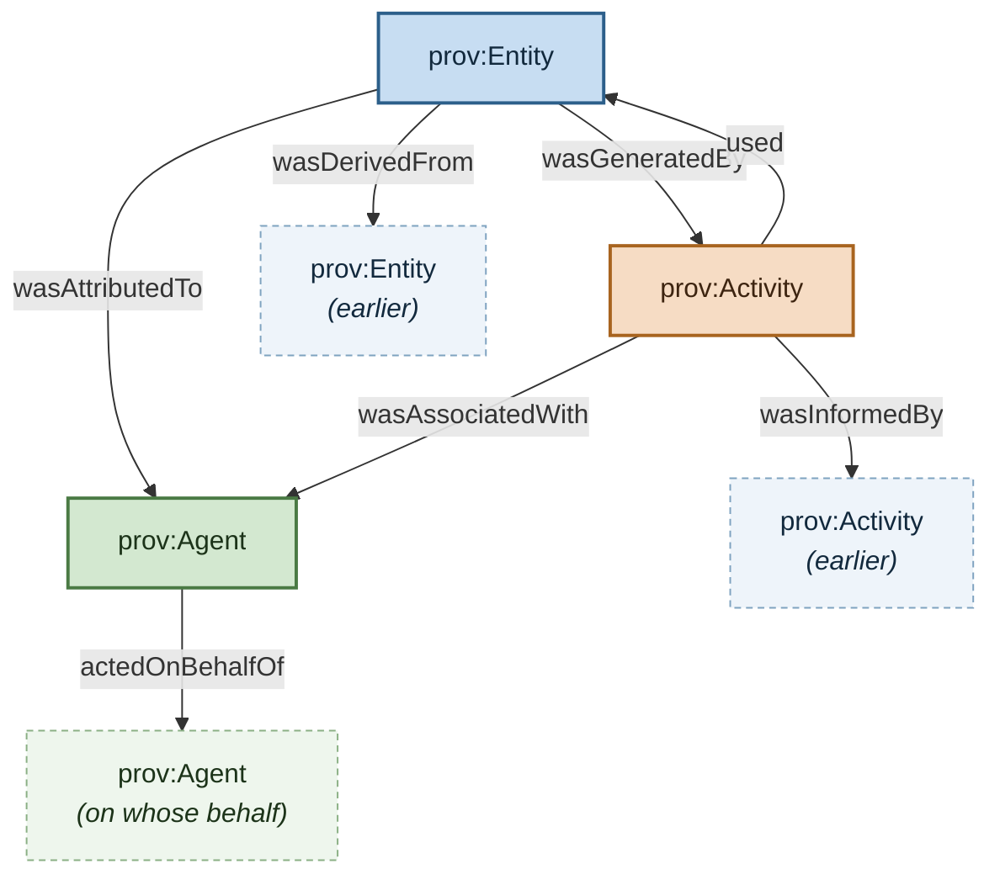
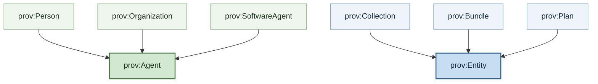
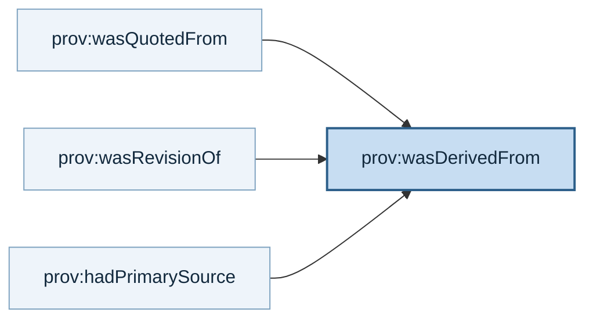
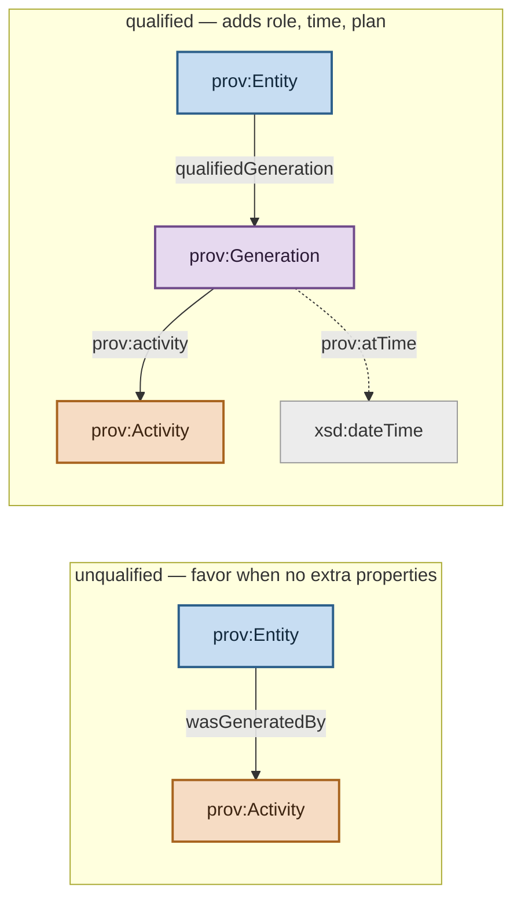
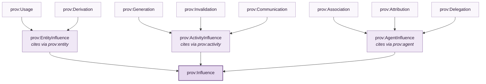

# PROV-O — Visual Map of the Ontology

A visual rendering of the terms [[prov-o]] defines, drawn from the KB's 24 PROV entity
pages. PROV-O groups its terms into **three incremental categories** ⟨§2⟩ — the diagrams
below follow that same grouping, one per category.

All claims are [[prov-o]]'s own, with section locators. Namespace: `http://www.w3.org/ns/prov#`.

---

## 1. Starting Point Terms ⟨§3.1⟩

The small set of classes and properties providing the basis for the rest of the ontology.
Three classes, and the properties relating them.

The three faded nodes are **the same classes**, drawn separately to show the
self-referential relations clearly: an Entity is derived from another Entity, an Activity
is informed by another Activity, an Agent acts on behalf of another Agent.

The three starting-point classes:

| Class | Definition ⟨§3.1⟩ |
|---|---|
| [[prov-entity]] | A physical, digital, conceptual, or other kind of thing with some fixed aspects; entities may be real or imaginary. |
| [[prov-activity]] | Something that occurs over a period of time and acts upon or with entities — consuming, processing, transforming, modifying, relocating, using, or generating them. |
| [[prov-agent]] | Something that bears some form of responsibility for an activity taking place, for the existence of an entity, or for another agent's activity. |

The seven relations above, plus `prov:startedAtTime` / `prov:endedAtTime` on Activity ⟨§3.1⟩:

[[prov-wasgeneratedby]] · [[prov-used]] · [[prov-wasinformedby]] · [[prov-wasderivedfrom]] · [[prov-wasattributedto]] · [[prov-wasassociatedwith]] · [[prov-actedonbehalfof]]

**Two chain-forming properties** are worth isolating, because each lets a provenance chain
be built from a single class ⟨§3.1⟩:

- `prov:wasInformedBy` provides dependency information between Activities *without*
  explicitly providing start and end times — allowing **provenance chains comprising only
  Activities**.
- `prov:wasDerivedFrom` is a transformation of one entity into another — allowing
  **provenance chains comprising only Entities**.

---

## 2. Expanded Terms ⟨§3.2⟩

Additional terms relating the starting-point classes: subclasses, the influence
superproperty, derivation subproperties, and abstraction links.

### Subclass hierarchy

Arrows read *"is a subclass of"*. Three Agent subclasses and three Entity subclasses ⟨§3.2⟩:

| Term | Definition ⟨§3.2⟩ |
|---|---|
| [[prov-collection]] | An Entity providing a structure (e.g. set, list) to constituents that are themselves Entities; `prov:hadMember` asserts membership. |
| [[prov-bundle]] | A named set of provenance descriptions, which may itself have provenance. A Bundle is an abstract set of RDF triples — adding or removing a triple creates a new, distinct Bundle. |
| [[prov-plan]] | An Entity representing a set of actions or steps intended by one or more agents to achieve some goals. |

### Derivation subproperties and abstraction links

| Property | Meaning ⟨§3.2⟩ |
|---|---|
| [[prov-wasquotedfrom]] | Cites a potentially larger Entity from which a new Entity was created by repeating some or all of the original. |
| [[prov-wasrevisionof]] | Indicates the derived Entity contains substantial content from the original. |
| [[prov-hadprimarysource]] | Cites a preceding Entity produced by some agent with direct experience and knowledge about the topic. |

Two further links relate Entities without derivation ⟨§3.2⟩ — [[prov-specializationof]]
links a more specific Entity to a more general one, while [[prov-alternateof]] links
Entities presenting aspects of the same thing, *but not necessarily the same aspects or at
the same time*.

Above all of these sits [[prov-influence]]'s property form: `prov:wasInfluencedBy` is a
**superproperty** relating any influenced Entity, Activity, or Agent to any other
influencing Entity, Activity, or Agent that had an effect on its characteristics ⟨§3.2⟩.

---

## 3. Qualified Terms ⟨§3.3⟩

The result of applying the [[qualification-pattern]] to the unqualified relations. The
pattern restates a binary relation using an **intermediate class** representing the
influence itself, which can then carry additional descriptions ⟨§3.3⟩.

### The pattern

PROV-O's own normative guidance on which form to use ⟨§3.3⟩:

> Consuming applications **should recognize both** qualified and unqualified forms, and
> treat the qualified form as **implying** the unqualified form; because the qualified form
> is more verbose, **the unqualified form should be favored** where additional properties
> are not provided.

**Seven Starting Point relations and seven Expanded relations** can be further described
using this pattern, per the normative Tables 2 and 3 ⟨§3.3⟩.

### Influence class hierarchy

All influence classes extend [[prov-influence]] *and* one of three intermediate classes,
which determine the property used to cite the influencing resource ⟨§3.3⟩:

PROV-O states **the most specific subclasses should be used when applicable** ⟨§3.3⟩.

Qualified influence classes with pages in this KB:
[[prov-generation]] · [[prov-usage]] · [[prov-derivation]] · [[prov-association]] · [[prov-attribution]] · [[prov-influence]]

`prov:atTime` can describe any `prov:InstantaneousEvent` — including `prov:Start`,
`prov:Generation`, `prov:Usage`, `prov:Invalidation`, and `prov:End` ⟨§3.3⟩.

---

## Reading these diagrams

They render the **structure PROV-O declares**, not a worked provenance example. Three
caveats on fidelity:

- Arrow direction follows the property name — `E -->|wasGeneratedBy| A` reads
  *"Entity wasGeneratedBy Activity"*. In the subclass diagrams, arrows read
  *"is a subclass of"* and point at the parent.
- Colour is a reading aid for the three starting-point classes (Entity, Activity, Agent)
  and their influence counterparts; it carries no ontological meaning.
- The diagrams cover the terms this KB has pages for. PROV-O defines further Expanded and
  Qualified terms — `prov:Start`, `prov:End`, `prov:Invalidation`, `prov:Communication`,
  `prov:Delegation`, `prov:Role`, `prov:InstantaneousEvent`, `prov:atLocation`,
  `prov:hadMember`, `prov:value`, and others — which appear here only where they clarify a
  hierarchy. See [[prov-o]] §3.2–§3.3 for the full term list.

## Concepts
[[provenance]] · [[provenance-influence]] · [[derivation]] · [[qualification-pattern]]

## Entities
[[prov-entity]] · [[prov-activity]] · [[prov-agent]] · [[prov-wasgeneratedby]] · [[prov-used]] · [[prov-wasinformedby]] · [[prov-wasderivedfrom]] · [[prov-wasattributedto]] · [[prov-wasassociatedwith]] · [[prov-actedonbehalfof]] · [[prov-collection]] · [[prov-bundle]] · [[prov-plan]] · [[prov-wasquotedfrom]] · [[prov-wasrevisionof]] · [[prov-hadprimarysource]] · [[prov-specializationof]] · [[prov-alternateof]] · [[prov-influence]] · [[prov-generation]] · [[prov-usage]] · [[prov-derivation]] · [[prov-association]] · [[prov-attribution]]

## Sources
[[prov-o]] _(standard)_

## Related domains
[[semantic-web]] · [[metadata]] · [[ontology-engineering]] · [[ai-governance]]
